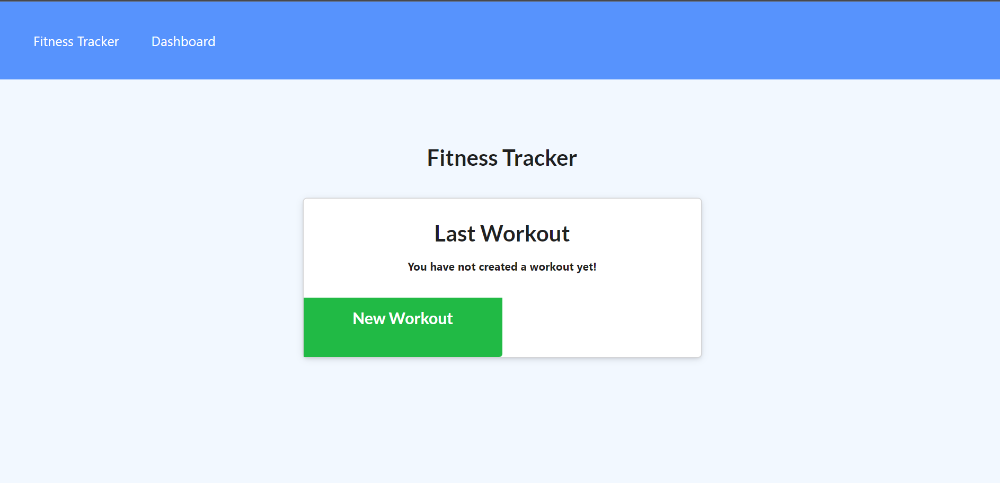

# **Fiit Track**

### *Fiit Track is an application that allows you to keep track of your workouts by inputting exercises and displaying them on a chart.* 

##  

## Mock Up
  

## Table of Contents 

1. [Installation](#installation)

2. [Usage](#usage)

3. [Contributing](#contributing)

4. [Test](#test)

5. [Questions](#questions)

## Installation 

None.

## Usage 

Use this app to track your workouts.

## Contributing 

N/A

## Test 

None.

## Questions 

Email: parkers205@gmail.com 

GitHub: https://github.com/parkersatterfield 

---

## License Information 
APACHE 2.0 (Not really, I am just showing of my README generator app).

            